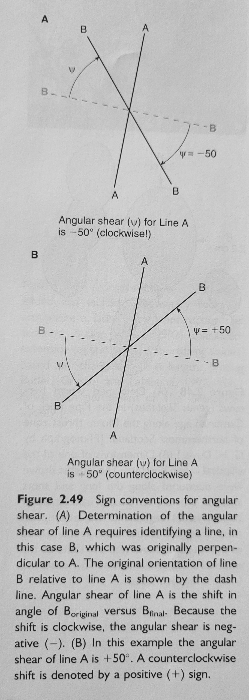

- A [[strain]] parameter symbolized by the Greek letter psi ψ which measures the changes that take place in the angle of a given line L
- Angular shear is determined by finding a line which was originally perpendicular to L and measuring the change in angle, describing the result with a sign (positive meaning counterclockwise) and a magnitude in degrees
- 
-
- [[Structural Geology of Rocks and Regions]], 3rd ed