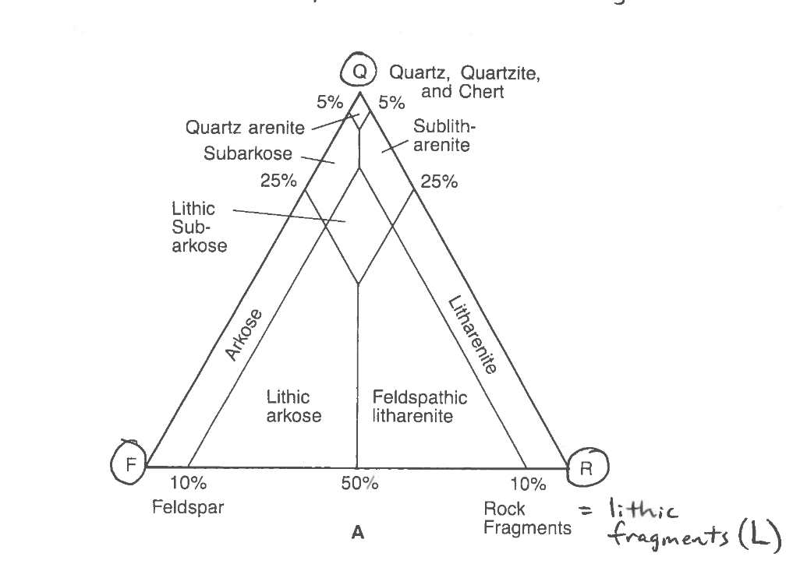

- a type of [[sandstone]] having less than 15% matrix and made up of quartz, feldspar, and lithic fragments
- [[quartz arenite]] - only 5% or less of the rock is composed of material other than quartz
- [[subarkose]] - primarily quartz
	- 5-25% of the rock is composed of feldspar and lithics, and over 90% of the other material is feldspar
- [[sublitharenite]] - 5-25% of the rock is composed of feldspar and lithics, and over 50% of the other material is lithics
- [[lithic subarkose]] - 5-25% of the rock is composed of feldspar and lithics, 75-95% quartz, and more than 10% of both feldspar and lithic fragments
- [[arkose]] - less than 75% quartz grains, at least 90% of the rest is feldspar
- [[arkosic arenite]] - less than 75% of the rock is composed of quartz, and over 50% of the other material is feldspar
- [[lithic arenite]] - less than 75% of the rock is composed of quartz, and over 50% of the other material is lithics
- 