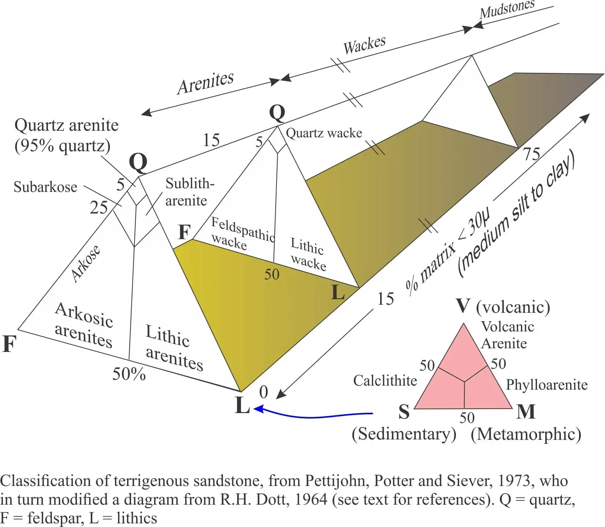

- two separate QFL (quartz - feldspar - lithics) diagrams are used to classify sandstones
- the first is for [[arenite]] and [[arkose]] sandstones, which have less than 15% matrix surrounding the grains
- the second is for [[Wacke]], which contains 15-75% matrix
- 
- for sandstones with less than 15% matrix
	- [[quartz arenite]] - only 5% or less of the rock is composed of material other than quartz
	- [[subarkose]] - primarily quartz
		- 5-25% of the rock is composed of feldspar and lithics, and over 90% of the other material is feldspar
	- [[sublitharenite]] - 5-25% of the rock is composed of feldspar and lithics, and over 50% of the other material is lithics
	- [[lithic subarkose]] - 5-25% of the rock is composed of feldspar and lithics, 75-95% quartz, and more than 10% of both feldspar and lithic fragments
- [[arkose]] - less than 75% quartz grains, at least 90% of the rest is feldspar
- [[lithic arkose]] - less than 75% of the rock is composed of quartz, and 50-90% of the other material is feldspar
- [[litharenite]] - less than 75% quartz grains, at least 90% of the remainder is lithics
- [[feldspathic litharenite]] - less than 75% of the rock is composed of quartz, and 50-90% of the other material is lithics
- 