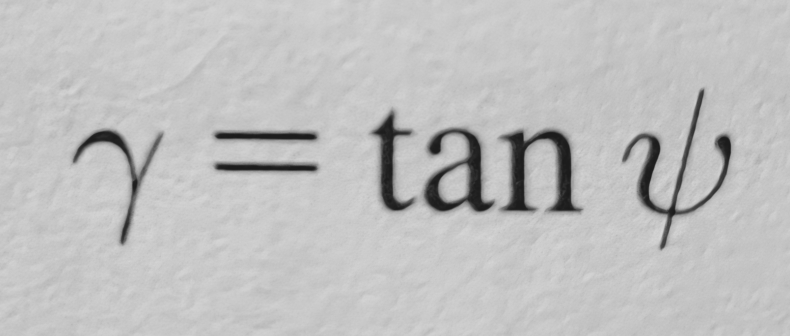

- Shear [[strain]], symbolized by the Greek letter gamma *γ*, is the deformation of points on a line in response to [[angular shear]], as the distance of movement is directly related to the angle of angular shear
- Calculated as the tangent of angular shear
- 