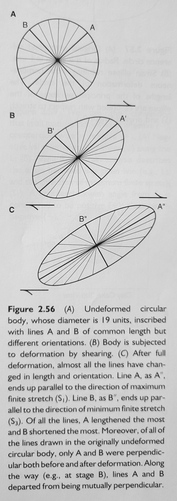

- A [[strain]] ellipse describes the distortion accommodated by a geologic body
- The long and short axes are perpendicular and aligned with the only mutually perpendicular directions in the body that were perpendicular before deformation
- The lines aligning with the long and short axes are called the finite stretching axes, where the long axis represents the direction and magnitude of maximum finite stretch and the short axis represents the minimum finite stretch
- 
-
- [[Structural Geology of Rocks and Regions]], 3rd ed p73